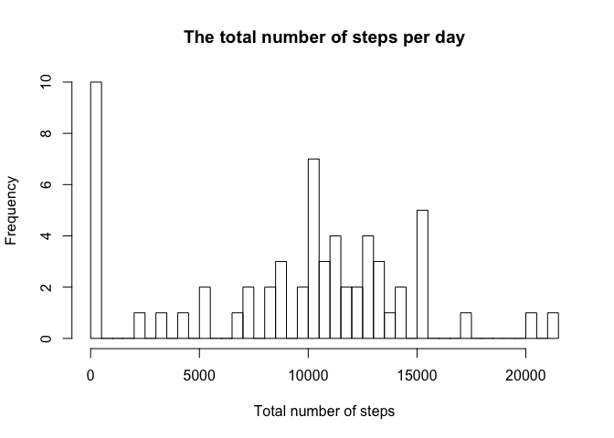
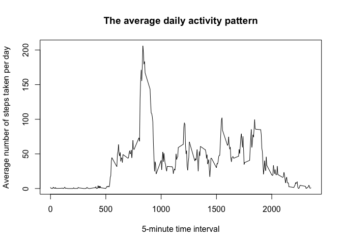
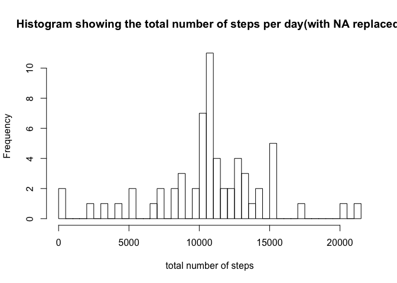
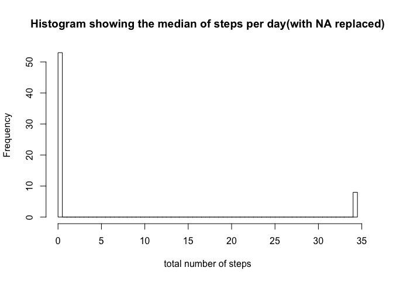
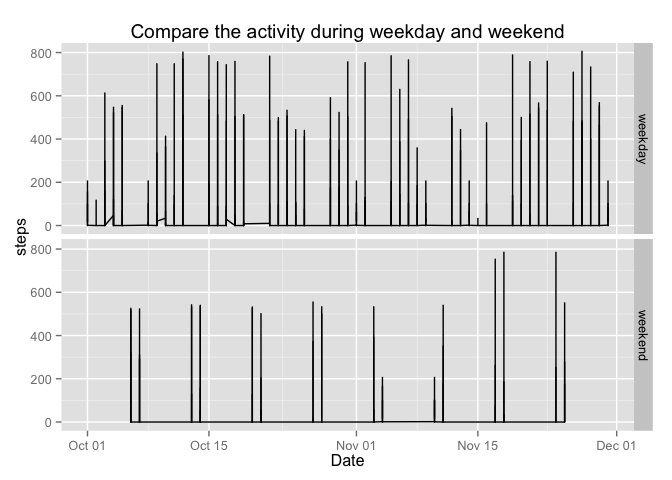

# Reproducible Research: Peer Assessment 1

## Loading and preprocessing the data

```r
Df <-read.csv("activity.csv") ## Read in the raw data
Df[,2] <- as.Date(Df$date, "%Y-%m-%d") ##Change the date column to Date format in R
```

## What is mean total number of steps taken per day?
### 1. The total number of steps taken per day

```r
steps_sum <- tapply(Df$steps, Df$date, sum, na.rm=TRUE) ##Calculate the sum of each day with tapply, and ignore the NA values

steps_sum
```

```
## 2012-10-01 2012-10-02 2012-10-03 2012-10-04 2012-10-05 2012-10-06 
##          0        126      11352      12116      13294      15420 
## 2012-10-07 2012-10-08 2012-10-09 2012-10-10 2012-10-11 2012-10-12 
##      11015          0      12811       9900      10304      17382 
## 2012-10-13 2012-10-14 2012-10-15 2012-10-16 2012-10-17 2012-10-18 
##      12426      15098      10139      15084      13452      10056 
## 2012-10-19 2012-10-20 2012-10-21 2012-10-22 2012-10-23 2012-10-24 
##      11829      10395       8821      13460       8918       8355 
## 2012-10-25 2012-10-26 2012-10-27 2012-10-28 2012-10-29 2012-10-30 
##       2492       6778      10119      11458       5018       9819 
## 2012-10-31 2012-11-01 2012-11-02 2012-11-03 2012-11-04 2012-11-05 
##      15414          0      10600      10571          0      10439 
## 2012-11-06 2012-11-07 2012-11-08 2012-11-09 2012-11-10 2012-11-11 
##       8334      12883       3219          0          0      12608 
## 2012-11-12 2012-11-13 2012-11-14 2012-11-15 2012-11-16 2012-11-17 
##      10765       7336          0         41       5441      14339 
## 2012-11-18 2012-11-19 2012-11-20 2012-11-21 2012-11-22 2012-11-23 
##      15110       8841       4472      12787      20427      21194 
## 2012-11-24 2012-11-25 2012-11-26 2012-11-27 2012-11-28 2012-11-29 
##      14478      11834      11162      13646      10183       7047 
## 2012-11-30 
##          0
```

### 2. A histogram of the total number of steps taken each day

```r
hist(steps_sum, breaks=50, xlab="Total number of steps", main="The total number of steps per day")
```

 

### 3. The mean and the median of the number of steps taken per day

```r
tapply(Df$steps, Df$date, mean, na.rm=TRUE)
```

```
## 2012-10-01 2012-10-02 2012-10-03 2012-10-04 2012-10-05 2012-10-06 
##        NaN  0.4375000 39.4166667 42.0694444 46.1597222 53.5416667 
## 2012-10-07 2012-10-08 2012-10-09 2012-10-10 2012-10-11 2012-10-12 
## 38.2465278        NaN 44.4826389 34.3750000 35.7777778 60.3541667 
## 2012-10-13 2012-10-14 2012-10-15 2012-10-16 2012-10-17 2012-10-18 
## 43.1458333 52.4236111 35.2048611 52.3750000 46.7083333 34.9166667 
## 2012-10-19 2012-10-20 2012-10-21 2012-10-22 2012-10-23 2012-10-24 
## 41.0729167 36.0937500 30.6284722 46.7361111 30.9652778 29.0104167 
## 2012-10-25 2012-10-26 2012-10-27 2012-10-28 2012-10-29 2012-10-30 
##  8.6527778 23.5347222 35.1354167 39.7847222 17.4236111 34.0937500 
## 2012-10-31 2012-11-01 2012-11-02 2012-11-03 2012-11-04 2012-11-05 
## 53.5208333        NaN 36.8055556 36.7048611        NaN 36.2465278 
## 2012-11-06 2012-11-07 2012-11-08 2012-11-09 2012-11-10 2012-11-11 
## 28.9375000 44.7326389 11.1770833        NaN        NaN 43.7777778 
## 2012-11-12 2012-11-13 2012-11-14 2012-11-15 2012-11-16 2012-11-17 
## 37.3784722 25.4722222        NaN  0.1423611 18.8923611 49.7881944 
## 2012-11-18 2012-11-19 2012-11-20 2012-11-21 2012-11-22 2012-11-23 
## 52.4652778 30.6979167 15.5277778 44.3993056 70.9270833 73.5902778 
## 2012-11-24 2012-11-25 2012-11-26 2012-11-27 2012-11-28 2012-11-29 
## 50.2708333 41.0902778 38.7569444 47.3819444 35.3576389 24.4687500 
## 2012-11-30 
##        NaN
```

```r
tapply(Df$steps, Df$date, median, na.rm=TRUE)
```

```
## 2012-10-01 2012-10-02 2012-10-03 2012-10-04 2012-10-05 2012-10-06 
##         NA          0          0          0          0          0 
## 2012-10-07 2012-10-08 2012-10-09 2012-10-10 2012-10-11 2012-10-12 
##          0         NA          0          0          0          0 
## 2012-10-13 2012-10-14 2012-10-15 2012-10-16 2012-10-17 2012-10-18 
##          0          0          0          0          0          0 
## 2012-10-19 2012-10-20 2012-10-21 2012-10-22 2012-10-23 2012-10-24 
##          0          0          0          0          0          0 
## 2012-10-25 2012-10-26 2012-10-27 2012-10-28 2012-10-29 2012-10-30 
##          0          0          0          0          0          0 
## 2012-10-31 2012-11-01 2012-11-02 2012-11-03 2012-11-04 2012-11-05 
##          0         NA          0          0         NA          0 
## 2012-11-06 2012-11-07 2012-11-08 2012-11-09 2012-11-10 2012-11-11 
##          0          0          0         NA         NA          0 
## 2012-11-12 2012-11-13 2012-11-14 2012-11-15 2012-11-16 2012-11-17 
##          0          0         NA          0          0          0 
## 2012-11-18 2012-11-19 2012-11-20 2012-11-21 2012-11-22 2012-11-23 
##          0          0          0          0          0          0 
## 2012-11-24 2012-11-25 2012-11-26 2012-11-27 2012-11-28 2012-11-29 
##          0          0          0          0          0          0 
## 2012-11-30 
##         NA
```

## What is the average daily activity pattern?
### The time series plot of the 5-mintue interval and the average number of steps taken, averaged across all days

```r
steps_mean <- tapply(Df$steps, Df$interval, mean, na.rm=TRUE) ## Calucate the mean of steps for each time interval
I <- unique(Df$interval) 
plot(I, steps_mean, type="l", xlab="5-minute time interval", ylab="Average number of steps taken per day", main="The average daily activity pattern")
```

 

### The maximun number of steps in the 5-minute interval

```r
New_df <- as.data.frame(cbind(steps_mean, I)) ##Create a data frame with the steps mean with the corresponding time interval
Max_step <- max(steps_mean) ## Find out the maximun number of the steps
New_df[ New_df$steps_mean %in% Max_step, 2] ## Subset the time interval with the maximun number of steps
```

```
## [1] 835
```

## Imputing missing values
### The total number of NA in the dataset

```r
sum(is.na(Df))
```

```
## [1] 2304
```

### Fill in the NAs

```r
Df$steps[is.na(Df$steps)] <- tapply(Df$steps, Df$interval, mean, na.rm = TRUE) ## Fill in the NA value with the mean of the steps taken at 5-minute time interval
```

### Histogram, mean and median of total number of steps per day 

```r
steps_sum <- tapply(Df$steps, Df$date, sum, na.rm=TRUE)

hist(steps_sum, breaks=50, xlab="total number of steps", main="Histogram showing the total number of steps per day(with NA replaced)")
```

 

```r
step_median_new <- tapply(Df$steps, Df$date, median, na.rm=TRUE)

hist(step_median_new, breaks=50, xlab="total number of steps", main="Histogram showing the median of steps per day(with NA replaced)")
```

 

## Are there differences in activity patterns between weekdays and weekends?
### Adding weekday and weekend variable

```r
library("lubridate") ## Use lubridate package
Df$WD <- wday(Df$date) ## Add a new column (WD), indicating the day of the week(in number format)
Df$WD[Df$WD==1|Df$WD==7] <-"weekend" ## Convert the day 1 and 7 of the week to weekend
Df$WD[Df$WD== 2|Df$WD== 3|Df$WD== 4|Df$WD== 5|Df$WD== 6] <-"weekday" ## Convert the day 2,3,4,5,6 to weekday
```

### Plot of the time series weekday or weekend activity 

```r
library("ggplot2") ## Use ggplot2 package
qplot(date, steps, data=Df, geom="line", facets=WD~., xlab="Date", ylab="steps", main="Compare the activity during weekday and weekend")
```

 
